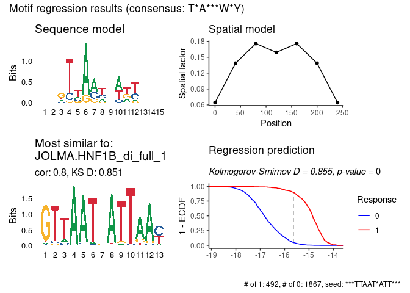

<!-- README.md is generated from README.Rmd. Please edit that file -->

# prego

<!-- badges: start -->

[](https://lifecycle.r-lib.org/articles/stages.html#experimental)
[](https://CRAN.R-project.org/package=prego)
<!-- badges: end -->

The `prego` package implements simple regression algorithms for finding
motifs in DNA. You can either use it to find motif which are
discriminating between two or more clusters of DNA sequences, or for
generating motifs from one or more continuous variables.

The PREGO algorithm is described
[here](https://doi.org/10.1101%2Fgr.5113606).

## Installation

You can install the development version of prego like so:

``` r
remotes::install_github("tanaylab/prego")
```

## Usage

``` r
library(prego)
#> ℹ Parallelization enabled. Using 77 threads.
```

For a set of continuous variables:

``` r
res <- regress_pwm(sequences_example, response_mat_example)
#> ℹ Using "r2" as the final metric
#> ℹ Number of response variables: 5
#> 
#> ── Generate candidate kmers
#> 
#> ── Regress each candidate kmer on sampled data
#> ℹ Running regression on 10 candidate kmers
#> • Bidirectional: TRUE
#> • Spat min: 0
#> • Spat max: 300
#> • Spat bin: 50
#> • Improve epsilon: 1e-04
#> • Min nuc prob: 0.001
#> • Uniform prior: 0.05
#> • Score metric: "r2"
#> • Seed: 60427
#> ℹ Best motif: "***AACCATCT****", score (r2): 0.0679663803157184
plot_regression_qc(res)
#> Warning: The `<scale>` argument of `guides()` cannot be `FALSE`. Use "none" instead as
#> of ggplot2 3.3.4.
#> ℹ The deprecated feature was likely used in the ggseqlogo package.
#>   Please report the issue at <https://github.com/omarwagih/ggseqlogo/issues>.
```


For binary response:

``` r
res_binary <- regress_pwm(cluster_sequences_example, cluster_mat_example[, 1])
#> ℹ Using "ks" as the final metric
#> ℹ Number of response variables: 1
#> 
#> ── Generate candidate kmers
#> 
#> ── Regress each candidate kmer on sampled data
#> ℹ Running regression on 10 candidate kmers
#> • Bidirectional: TRUE
#> • Spat min: 0
#> • Spat max: 300
#> • Spat bin: 50
#> • Improve epsilon: 1e-04
#> • Min nuc prob: 0.001
#> • Uniform prior: 0.05
#> • Score metric: "r2"
#> • Seed: 60427
#> ℹ Best motif: "***TTAA*CATT***", score (ks): 0.857117195971103
plot_regression_qc(res_binary)
```



For clusters of sequences:

``` r
res <- regress_pwm.clusters(cluster_sequences_example, clusters_example)
#> ℹ Using sampled optimization
#> ℹ Running regression for 5 clusters
#> ℹ Matching with motif databases
#> Warning: Automatic coercion from double to character was deprecated in purrr 1.0.0.
#> ℹ Please use an explicit call to `as.character()` within `map_chr()` instead.
#> ℹ The deprecated feature was likely used in the prego package.
#>   Please report the issue to the authors.
res$stats
#> # A tibble: 5 × 7
#>   cluster consensus  ks_D    r2 seed_motif      db_match              db_match…¹
#>   <chr>   <chr>     <dbl> <dbl> <chr>           <chr>                 <chr>     
#> 1 c100    WGA***AT  0.665 0.311 ***TGA*GGATG*** HOMER.Hoxb4           0.790131  
#> 2 c111    TTAY*R    0.837 0.498 ***TTTACAAC**** JASPAR.Abd-B          0.825818  
#> 3 c29     T*A       0.830 0.541 ***TTA*TCATT*** JOLMA.HNF1B_di_full_1 0.754056  
#> 4 c5      GATA      0.600 0.187 ***CTGA*AAGG*** JOLMA.GATA3_mono_DBD  0.937572  
#> 5 c6      ATC       0.611 0.273 ***TCTTATCT**** HOMER.Gata2           0.834088  
#> # … with abbreviated variable name ¹​db_match_cor
```
