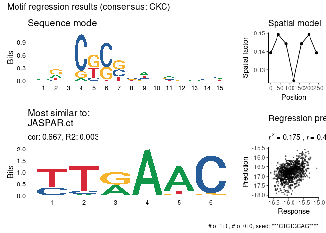

<!-- README.md is generated from README.Rmd. Please edit that file -->

# prego

<!-- badges: start -->

[](https://lifecycle.r-lib.org/articles/stages.html#experimental)
[](https://CRAN.R-project.org/package=prego)
<!-- badges: end -->

The `prego` package implements simple regression algorithms for finding
motifs in DNA. You can either use it to find motif which are
discriminating between two or more clusters of DNA sequences, or for
generting motifs from one or more continuous variables.

The PREGO algorithm is described
[here](https://doi.org/10.1101%2Fgr.5113606).

## Installation

You can install the development version of prego like so:

``` r
remotes::install_github("tanaylab/prego")
```

## Usage

``` r
library(prego)
#> ℹ Parallelization enabled. Using 77 threads.
```

For a set of continuous variables:

``` r
res <- regress_pwm(sequences_example, response_mat_example)
#> ℹ Number of response variables: 5
#> ℹ Screening for kmers in order to initialize regression
#> ℹ Number of response variables: 5
#> ℹ Screening kmers of length 8, from position 0 to position 300
#> ℹ minimal correlation: 0.08, minimal number of occurrences: 50
#> ✔ Found 2138 kmers in 1000 sequences.
#> ℹ Motif is shorter than 15, extending with wildcards
#> ℹ Initializing regression with the following motif: "***TTTACAAC****"
#> ℹ Running regression
#> • Motif length: 15
#> • Bidirectional: TRUE
#> • Spat min: 0
#> • Spat max: 300
#> • Spat bin: 50
#> • Improve epsilon: 0.0001
#> • Min nuc prob: 0.001
#> • Uniform prior: 0.05
#> • Score metric: "r2"
#> • Seed: 60427
#> ✔ Finished running regression. Consensus: "TTACRAC"
#> ✔ R^2: 0.01, 0.0054, 0.0373, 0.0002, and 0.0087
plot_regression_qc(res)
#> Warning: `guides(<scale> = FALSE)` is deprecated. Please use `guides(<scale> = "none")` instead.
#> `guides(<scale> = FALSE)` is deprecated. Please use `guides(<scale> = "none")` instead.
```



For binary response:

``` r
res_binary <- regress_pwm(cluster_sequences_example, cluster_mat_example[, 1])
#> ℹ Number of response variables: 1
#> ℹ Screening for kmers in order to initialize regression
#> ℹ Number of response variables: 1
#> ℹ Screening kmers of length 8, from position 0 to position 300
#> ℹ minimal correlation: 0.08, minimal number of occurrences: 50
#> ✔ Found 198 kmers in 2359 sequences.
#> ℹ Motif is shorter than 15, extending with wildcards
#> ℹ Initializing regression with the following motif: "***TAATCATT****"
#> ℹ Running regression
#> • Motif length: 15
#> • Bidirectional: TRUE
#> • Spat min: 0
#> • Spat max: 300
#> • Spat bin: 50
#> • Improve epsilon: 0.0001
#> • Min nuc prob: 0.001
#> • Uniform prior: 0.05
#> • Score metric: "r2"
#> • Seed: 60427
#> ✔ Finished running regression. Consensus: "T*A***W*T"
#> ✔ KS test D: 0.8507, p-value: 0
plot_regression_qc(res_binary)
#> Warning: `guides(<scale> = FALSE)` is deprecated. Please use `guides(<scale> = "none")` instead.
#> `guides(<scale> = FALSE)` is deprecated. Please use `guides(<scale> = "none")` instead.
```


For clusters of sequences:

``` r
res <- regress_pwm.clusters(cluster_sequences_example, clusters_example)
#> ℹ Using single-phase optimization
#> ℹ Running regression for 5 clusters
#> ℹ Matching with motif databases
res$stats
#> # A tibble: 5 x 7
#>   cluster consensus      ks_D        r2      seed_motif              db_match db_match_dist
#> 1    c100   AT***TC 0.7024075 0.3852463 ***ATCCATCA**** JASPAR.MEIS1.MA1639.1      0.244724
#> 2    c111   Y*RTAAA 0.8479663 0.4978355 ***CAATTAAC****   JOLMA.CDX1_mono_DBD      0.152716
#> 3     c29 T*A***W*T 0.8507039 0.5581745 ***TAATCATT****            HOMER.Hnf1      0.340463
#> 4      c5      GATA 0.5887910 0.2227806 ***CTGATAAG****      JASPAR.GATA1/2/3      0.198050
#> 5      c6      TATC 0.6160721 0.2783910 ***TCTTATCT****          JASPAR.GATAd      0.219126
```
