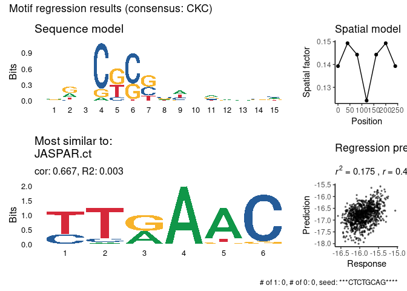
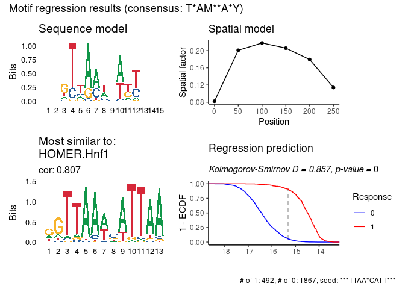

# prego

The `prego` package implements simple regression algorithms for finding
motifs in DNA. You can either use it to find motif which are
discriminating between two or more clusters of DNA sequences, or for
generating motifs from one or more continuous variables.

The PREGO algorithm is described
[here](https://doi.org/10.1101%2Fgr.5113606).

## Installation

You can install the development version of prego like so:

``` r
remotes::install_github("tanaylab/prego")
```

## Usage

``` r
library(prego)
#> ℹ Parallelization enabled. Using 77 threads. 
```

For a set of continuous variables:

``` r
res <- regress_pwm(sequences_example, response_mat_example)
#> ℹ Using "r2" as the final metric
#> ℹ Number of response variables: 5
#> 
#> ── Generate candidate kmers
#> 
#> ── Regress each candidate kmer
#> ℹ Running regression on 10 candidate kmers
#> • Bidirectional: TRUE
#> • Spat bin size: 40
#> • Number of spatial bins 7
#> • Length of sequence: 280
#> • Min gap: 0
#> • Max gap: 1
#> • Kmer length: 8
#> • Improve epsilon: 1e-04
#> • Min nuc prob: 0.001
#> • Uniform prior: 0.05
#> • Score metric: "r2"
#> • Seed: 60427
#> • kmer: "TTTACAAC", score (r2): 0.0126890005368537
#> • kmer: "TA*CTGCTG", score (r2): 0.00334159650449452
#> • kmer: "AACCATCT", score (r2): 0.0643097230120355
#> • kmer: "AGA*AAGAA", score (r2): 0.060384757659326
#> • kmer: "TTATC*TCT", score (r2): 0.0657310811484614
#> • kmer: "TCACCTTG", score (r2): 0.0623381197705449
#> • kmer: "CTCTGCAG", score (r2): 0.0677598761958694
#> • kmer: "TAGCTGTC", score (r2): 0.0640768115164421
#> • kmer: "GACAAT*CT", score (r2): 0.0607251519441225
#> • kmer: "TCTTATCT", score (r2): 0.0628163788281552
#> ℹ Best match in the database: "JASPAR.ct", cor: 0.667
#> ℹ Best motif: "***CTCTGCAG****", score (r2): 0.0677598761958694
plot_regression_qc(res)
#> Warning: The `<scale>` argument of `guides()` cannot be `FALSE`. Use "none" instead as
#> of ggplot2 3.3.4.
#> ℹ The deprecated feature was likely used in the ggseqlogo package.
#>   Please report the issue at <https://github.com/omarwagih/ggseqlogo/issues>.
#> This warning is displayed once every 8 hours.
#> Call `lifecycle::last_lifecycle_warnings()` to see where this warning was
#> generated.
```



For binary response:

``` r
res_binary <- regress_pwm(cluster_sequences_example, cluster_mat_example[, 1])
#> ℹ Using "ks" as the final metric
#> ℹ Number of response variables: 1
#> 
#> ── Generate candidate kmers
#> 
#> ── Regress each candidate kmer
#> ℹ Running regression on 10 candidate kmers
#> • Bidirectional: TRUE
#> • Spat bin size: 40
#> • Number of spatial bins 7
#> • Length of sequence: 280
#> • Min gap: 0
#> • Max gap: 1
#> • Kmer length: 8
#> • Improve epsilon: 1e-04
#> • Min nuc prob: 0.001
#> • Uniform prior: 0.05
#> • Score metric: "r2"
#> • Seed: 60427
#> • kmer: "TTAAT*ATT", score (ks): 0.854878919705105
#> • kmer: "AAT*ATTAA", score (ks): 0.854878919705105
#> • kmer: "TAAT*ATTA", score (ks): 0.843301065576269
#> • kmer: "GTTAAT*AT", score (ks): 0.844482257088238
#> • kmer: "AT*ATTAAC", score (ks): 0.844482257088238
#> • kmer: "AA*CATTAA", score (ks): 0.84950858078479
#> • kmer: "TTAA*CATT", score (ks): 0.849192870611084
#> • kmer: "TAATCATT", score (ks): 0.841995767306361
#> • kmer: "TTA*TCATT", score (ks): 0.845127829960678
#> • kmer: "TAA*CATTA", score (ks): 0.833248418183164
#> ℹ Best match in the database: "JOLMA.HNF1B_di_full_1", cor: 0.8
#> ✔ "JOLMA.HNF1B_di_full_1" KS test D: 0.8512, p-value: 0
#> ℹ Best motif: "***TTAAT*ATT***", score (ks): 0.854878919705105
plot_regression_qc(res_binary)
```



For clusters of sequences:

``` r
res <- regress_pwm.clusters(cluster_sequences_example, clusters_example)
#> ℹ Using sampled optimization
#> ℹ Running regression for 5 clusters
#> ℹ Matching with motif databases
res$stats
#> # A tibble: 5 × 7
#>   cluster consensus  ks_D    r2 seed_motif      db_match                 db_ma…¹
#>   <chr>   <chr>     <dbl> <dbl> <chr>           <chr>                      <dbl>
#> 1 c100    GA***AT   0.668 0.326 ***TGATGG*TG*** HOCOMOCO.PDX1_HUMAN.H11…   0.786
#> 2 c111    Y**TAAA   0.836 0.514 ***GC*ATAAAA*** JOLMA.CDX2_mono_DBD        0.889
#> 3 c29     T*A***W*Y 0.830 0.552 ***TTAA*CATT*** JOLMA.HNF1B_di_full_1      0.745
#> 4 c5      <NA>      0.569 0.194 ***TGAT*GATG*** JASPAR.CG15696-RA          0.725
#> 5 c6      ATC       0.606 0.262 ***TCTTATCT**** HOMER.Gata2                0.864
#> # … with abbreviated variable name ¹​db_match_cor
```
